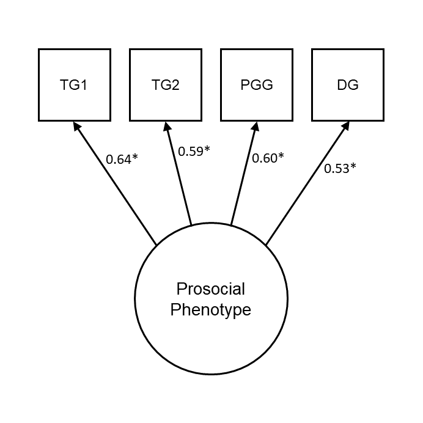
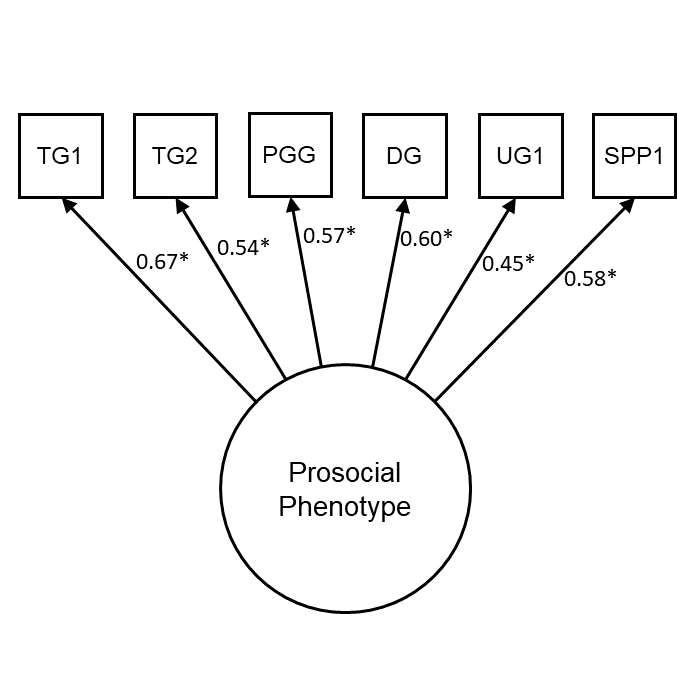

\renewcommand{\figurename}{Supplementary Figure}
\renewcommand{\tablename}{Supplementary Table}
\renewcommand{\thefigure}{\arabic{figure}} \setcounter{figure}{0}
\renewcommand{\thetable}{\arabic{table}} \setcounter{table}{0}
\renewcommand{\theequation}{\arabic{equation}} \setcounter{equation}{0}

# **Supplementary Information**

\setcounter{page}{1}
\centering
\noindent \footnotesize Prosocial phenotype predicts political views on hierarchy and redistribution eighteen months later \newline
\hspace*{8mm} \footnotesize Scott Claessens\textsuperscript{1}, Chris G Sibley\textsuperscript{1}, Ananish Chaudhuri\textsuperscript{2,3}, & Quentin D Atkinson\textsuperscript{1,4} \newline
\raggedright
\noindent \footnotesize \textsuperscript{1} School of Psychology, University of Auckland, New Zealand \newline
\noindent \footnotesize \textsuperscript{2} Department of Economics, University of Auckland, Auckland, New Zealand \newline
\noindent \footnotesize \textsuperscript{3} CESifo, Munich, Germany \newline
\noindent \footnotesize \textsuperscript{4} Max Planck Institute for the Science of Human History, Jena, Germany \newline
\normalsize
\newpage

## Supplementary Methods

### Descriptions for Ultimatum Game and Second-Party Punishment Game

In the main text, we test the robustness of our results to the inclusion of
prosocial behaviour in the following two games:

- _Ultimatum Game_. Player A starts with 100 points, and Player B starts with
  nothing. Player A must decide how many points to transfer to Player B. 
  However, Player B simultaneously specifies their 'minimum acceptable offer':
  namely, the lowest transfer from Player A that they will accept. If Player A's 
  transfer amount is lower than this minimum acceptable offer, both players end
  the game with 0 points. Otherwise, Player B receives the transfer amount, and
  Player A keeps the remaining points.
- _Second-Party Punishment Game_. Players A and B start with 100 points. This 
  game has two stages: the transfer stage, and the penalty stage. In the 
  transfer stage, each player decides whether to transfer 30 points to the other 
  player. Any transferred points are doubled before the other player receives 
  them. Decisions are made simultaneously. The transfer stage follows the payoff 
  matrix of a Prisoner's Dilemma. Then, in the penalty phase, both players can 
  pay 0–10 points to remove points from the other player, depending on their 
  decision in the transfer stage. Each paid point removes 5 points from the 
  other player.

### Procedure for economic game sessions

In both waves, participants were booked into sessions on midweek evenings and 
completed the session online in real-time. Session sizes varied between 14 and 
130 participants. Although participants knew they were completing the study with 
other participants from the New Zealand Attitudes and Values Study, they did not
know specifically who they were interacting with in the session or how many 
other people there were in the session.

Participants completed a consent form before proceeding to the eight 
behavioural tasks. In the first wave, all eight tasks were completed in a 
randomised order. In the second wave, the economic games shared with the first
wave were completed first in a randomised order, followed by two new tasks (the
rule following and social information use tasks) which were presented in a 
separately randomised order. For each task, participants read the instructions 
for the task, completed a comprehension question, and then proceeded to make 
their decisions. Participants did not receive any information about their 
earnings over the course of the session to avoid any potential wealth or 
learning effects between games.

As well as the prosocial decisions listed in the main text, participants in both 
waves also made punishment decisions in several punishment games (Ultimatum 
Game, Third Party Punishment Game, and Second Party Punishment Game). Moreover,
in the first wave, participants completed additional coordination games (Stag 
Hunt Game and Stag Hunt Game with Punishment) and, in the second wave, 
participants completed additional behavioural measures of rule following and 
social information use [@Claessens2023]. 

After making their decisions for all the tasks, participants entered a waiting 
lobby in which they waited for all other participants in their session to 
complete the tasks. If participants took longer than 55 minutes to complete the 
tasks, they were skipped ahead to the waiting lobby. Timeouts were still paid 
their show-up fee, but not their bonus. In the first wave, participants took 
`r printnum(mean(d$egame.SecsAll.T10 / 60), digits = 0)` minutes on average to 
complete all eight tasks (SD = 
`r printnum(sd(d$egame.SecsAll.T10 / 60), digits = 0)` minutes, range = 
`r printnum(min(d$egame.SecsAll.T10 / 60), digits = 0)` - 
`r printnum(max(d$egame.SecsAll.T10 / 60), digits = 0)` 
minutes), and in the second wave, participants took 
`r printnum(mean(d$egame.SecsAll.T11 / 60), digits = 0)` 
minutes on average (SD = `r printnum(sd(d$egame.SecsAll.T11 / 60), digits = 0)` 
minutes, range = `r printnum(min(d$egame.SecsAll.T11 / 60), digits = 0)` - 
`r printnum(max(d$egame.SecsAll.T11 / 60), digits = 0)` minutes).

After the sessions, participants were randomly matched into groups to determine 
bonus payments. After being matched, participants were informed about their 
outcomes in each of the economic games.

### Potential learning between waves

To determine whether learning occurred between waves and affected subsequent 
game behaviour, we estimated differences in behaviour between the two waves (see
Supplementary Table \@ref(tab:diffTable)). For all games except the Dictator 
Game, we found no differences in prosocial behaviour between waves. In the 
Dictator Game, participants gave slightly less in the second wave, but this 
difference was small (2 fewer points given, on average, out of 100). These 
results suggest that learning biases are not a major concern in our study.

### Potential bias due to dropouts between waves

Comparisons of drop-outs and non-drop-outs suggested that retention did not 
systematically bias our sample (see Supplementary Table \@ref(tab:biasTable)).

\newpage

## Supplementary Results

### Pre-registered measurement invariance results

We tested for measurement invariance of the prosocial phenotype factor 
structure in a series of increasingly restrictive nested models. For all model 
comparisons, we pre-registered the use of changes in fit statistics as 
thresholds for diagnosing reduced model fit 
[$\Delta$Comparative Fit Index (CFI) < -0.01, $\Delta$Root Mean Square Error of 
Approximation (RMSEA) > 0.015] rather than $\chi^2$ differences which are 
sensitive to large sample sizes. To deal with non-independence of observations, 
all measurement invariance models had correlated item errors across waves.

First, we fitted a configural invariance model, which freely estimated the two 
latent variables simultaneously (Supplementary Table \@ref(tab:tableCompareMIReduced)). 
As expected, this configural invariance model fitted the data well (CFI = 
`r printnum(fitMeasures(configMI_Reduced)['cfi'])`, RMSEA = 
`r printnum(fitMeasures(configMI_Reduced)['rmsea'])`) and all loadings were 
significantly positive. Second, we fitted a metric invariance model, which 
constrained the item loadings to equality across the two waves. Model fit did 
not substantially change ($\Delta$CFI = 
`r printnum(fitMeasures(metricMI_Reduced)['cfi'] - fitMeasures(configMI_Reduced)['cfi'], digits = 3)`, 
$\Delta$RMSEA = 
`r printnum(fitMeasures(metricMI_Reduced)['rmsea'] - fitMeasures(configMI_Reduced)['rmsea'], digits = 3)`). 
Third, we fitted a scalar invariance model, which constrained the item 
loadings, intercepts, and thresholds to equality across the two waves. Again, 
model fit did not substantially change ($\Delta$CFI = 
`r printnum(fitMeasures(scalarMI_Reduced)['cfi'] - fitMeasures(metricMI_Reduced)['cfi'], digits = 3)`, 
$\Delta$RMSEA = 
`r printnum(fitMeasures(scalarMI_Reduced)['rmsea'] - fitMeasures(metricMI_Reduced)['rmsea'], digits = 3)`).
Fourth, and finally, we fitted a strict invariance model, which constrained the 
item loadings, intercepts, thresholds, and variances to equality across waves. 
Model fit remained unchanged ($\Delta$CFI = 
`r printnum(fitMeasures(strictMI_Reduced)['cfi'] - fitMeasures(scalarMI_Reduced)['cfi'], digits = 3)`,
$\Delta$RMSEA = 
`r printnum(fitMeasures(strictMI_Reduced)['rmsea'] - fitMeasures(scalarMI_Reduced)['rmsea'], digits = 3)`).
Measurement invariance analysis thus supports strict invariance of the 
prosocial phenotype latent variable over time.

### Including the Ultimatum Game and Second-Party Punishment Game

```{r echo=F, message=F, warning=F, results="hide"}
tar_load(cfa_Full)
tar_load(sem1_Full)
s <- data.frame(summary(sem1_Full, ci = TRUE))
```

In addition to our pre-registered confirmatory factor analysis model with the
Trust Game (Give), Trust Game (Return), Dictator Game, and Public Goods Game,
we additionally included the Ultimatum Game (Offer) and Second-Party Punishment
Game (Give) to estimate the "prosocial phenotype" latent variable. As with our
pre-registered analysis, all factor loadings were significantly 
positive (_p_ < 0.05) and the model fitted the data well (CFI = 
`r printnum(as.numeric(fitMeasures(cfa_Full)['cfi']))`, RMSEA = 
`r printnum(as.numeric(fitMeasures(cfa_Full)['rmsea']))`, SRMR = 
`r printnum(as.numeric(fitMeasures(cfa_Full)['srmr']))`; Supplementary Figure 
\@ref(fig:cfaPlotFull)) [@Hu1999; @MacCallum1996]. The full set of games showed 
acceptable reliability in both the first wave ($\alpha$ = 
`r printnum(tar_read(reliability1_Full)$alpha)`, $\omega$ = 
`r printnum(tar_read(reliability1_Full)$omega.tot)`) and the second wave 
($\alpha$ = `r printnum(tar_read(reliability2_Full)$alpha)`, $\omega$ = 
`r printnum(tar_read(reliability2_Full)$omega.tot)`), and the zero-order 
correlations between games were all positive and small-to-medium in size 
(_r_ = 0.12 -- 0.39; Supplementary Figure \@ref(fig:plotCorsFull)) supporting
the existence of a single latent construct.

We fitted a structural equation model with SDO as the sole predictor of 
the prosocial phenotype latent variable, including the additional games. As with
our pre-registered analysis, we found that SDO significantly negatively 
predicted the prosocial phenotype (unstandardised _b_ = `r printnum(s[7,5])`, 
95% confidence interval [`r printnum(s[7,10])` `r printnum(s[7,11])`], _p_ 
`r printp(s[7,9])`; Supplementary Figure \@ref(fig:semPlotFull)).

We also assessed measurement invariance for the prosocial phenotype when 
including the Ultimatum Game and Second-Party Punishment Game. As with our
pre-registered analysis, we found support strict invariance of the prosocial
phenotype over time (Supplementary Table \@ref(tab:tableCompareMIFull)).

Finally, we repeated our pre-registered cross-lagged panel models including
the Ultimatum Game and Second-Party Punishment Game in the measurement model
for the prosocial phenotype (Supplementary Figures \@ref(fig:clpmPlotSDOdMFull)
-- \@ref(fig:clpmPlotPolNatdMFull)). The results for SDO and income attribution
beliefs were unchanged from the pre-registered models. However, in the model
with additional games, the prosocial phenotype no longer predicted future 
support for income redistribution and *positively* predicted future support for
the National Party. This latter result is difficult to square with the negative
bivariate correlation between the prosocial phenotype in the first wave and
support for the National party in the second wave (_r_ = 
`r printnum(standardizedSolution(tar_read(sem2_PolNat_Full))[7,"est.std"])`).

\newpage

## Supplementary Figures

(ref:timelinePlotCaption) _Data collection timeline for NZAVS Wave 10, NZAVS 
Wave 11, and both waves of economic game data collection (n = `r 
printnum(nrow(tar_read(d)))`)._ Each point is an individual participant. Note 
the break in data collection in February 2019 due to the Christchurch 
terrorist attack.

```{r timelinePlot, echo=FALSE, warning=F, message=F, fig.width=7, fig.height=5, fig.cap="(ref:timelinePlotCaption)"}
tar_read(timeline)
```

\newpage

(ref:plotObsCaption) _Bar plot showing proportions of observed data for all 
variables included in the study_. T10 = NZAVS Wave 10, T11 = NZAVS Wave 11.

```{r plotObs, echo=FALSE, warning=F, message=F, fig.width=6, fig.height=4, fig.cap="(ref:plotObsCaption)"}
tar_read(plotObs)
```

\newpage

(ref:impPlotCaption) _Density plots showing imputed values from 20 multiply 
imputed datasets (pink) against observed values (blue)._ Data were imputed 
using predictive mean matching.

```{r impPlot, echo=FALSE, warning=F, message=F, fig.width=16, fig.height=10, fig.cap="(ref:impPlotCaption)"}
tar_read(plotImputation)
```

\newpage

(ref:cfaPlotReducedCaption) _Confirmatory factor model for the prosocial 
phenotype in Wave 2._ TG1 is treated as a binary endogenous variable. Numbers 
are standardised coefficients. *_p_ < 0.05. TG1 = Trust Game (Give), TG2 = Trust 
Game (Return), PGG = Public Goods Game, DG = Dictator Game.

```{r cfaPlotReduced, echo=FALSE, warning=F, message=F, out.width="80%", fig.cap="(ref:cfaPlotReducedCaption)"}

```

\newpage

(ref:plotCorsReducedCaption) _Zero-order correlations between game decisions in 
the first and second wave._ All _p_-values < 0.01. TG1 = Trust Game (Give), 
TG2 = Trust Game (Return), DG = Dictator Game, PGG = Public Goods Game.

```{r plotCorsReduced, echo=FALSE, warning=F, message=F, fig.width=7, fig.height=4, fig.cap="(ref:plotCorsReducedCaption)"}
tar_read(plotCors_Reduced)
```

\newpage

(ref:semPlotReducedCaption) _Social Dominance Orientation (mean score) is 
negatively related to model-predicted prosocial latent variable scores in the
second wave._

```{r semPlotReduced, echo=FALSE, warning=F, message=F, out.width="80%", fig.cap="(ref:semPlotReducedCaption)"}
tar_read(plotSem_Reduced)
```

\newpage

(ref:clpmPlotSDOdReducedCaption) _Results of cross-lagged panel model with the 
prosocial phenotype and SDO, analysing listwise-deleted data._ (a) 
Autoregressive effects, cross-lagged effects, and within-wave (residual) 
correlations from the model. Note that measurement models for the prosocial 
phenotype latent variables are omitted from this figure. Numbers are 
standardised coefficients, \*\*_p_ < 0.01, \*_p_ < 0.05. (b, c) Forest plots 
visualising the change in cross-lagged paths when controlling for time-invariant 
covariates, individually and in a full model. Points are unstandardised 
estimates, lines are 95% confidence intervals.

```{r clpmPlotSDOdReduced, echo=FALSE, warning=F, message=F, fig.width=7, fig.height=6, fig.cap="(ref:clpmPlotSDOdReducedCaption)"}
tar_read(clpmPlot_SDO_d_Reduced)
```

\newpage

(ref:clpmPlotIncReddMReducedCaption) _Results of cross-lagged panel model with 
the prosocial phenotype and support for income redistribution, pooling over 20
imputed datasets._ (a) Autoregressive effects, cross-lagged effects, and 
within-wave (residual) correlations from the model. Support for income 
redistribution is treated as ordinal. Note that measurement models for the 
prosocial phenotype latent variables are omitted from this figure. Numbers are 
standardised coefficients, \*\*\*_p_ < 0.001, \*\*_p_ < 0.01, \*_p_ < 0.05. 
(b, c) Forest plots visualising the change in cross-lagged paths when 
controlling for time-invariant covariates, individually and in a full model. 
Points are unstandardised estimates, lines are 95% confidence intervals. 

```{r clpmPlotIncReddMReduced, echo=FALSE, warning=F, message=F, fig.width=7, fig.height=6, fig.cap="(ref:clpmPlotIncReddMReducedCaption)"}
tar_read(clpmPlot_IncRed_dM_Reduced)
```

\newpage

(ref:clpmPlotIncReddReducedCaption) _Results of cross-lagged panel model with the
prosocial phenotype and support for income redistribution, analysing
listwise-deleted data._ (a) Autoregressive effects, cross-lagged effects, and 
within-wave (residual) correlations from the model. Support for income 
redistribution is treated as ordinal. Note that measurement models for the 
prosocial phenotype latent variables are omitted from this figure. Numbers are 
standardised coefficients, \*\*\*_p_ < 0.001, \*\*_p_ < 0.01, \*_p_ < 0.05. 
(b, c) Forest plots visualising the change in cross-lagged paths when 
controlling for time-invariant covariates, individually and in a full model. 
Points are unstandardised estimates, lines are 95% confidence intervals. 

```{r clpmPlotIncReddReduced, echo=FALSE, warning=F, message=F, fig.width=7, fig.height=6, fig.cap="(ref:clpmPlotIncReddReducedCaption)"}
tar_read(clpmPlot_IncRed_d_Reduced)
```

\newpage

(ref:clpmPlotIncAttdMReducedCaption) _Results of cross-lagged panel model with 
the prosocial phenotype and income attribution beliefs, pooling over 20 imputed
datasets._ (a) Autoregressive effects, cross-lagged effects, and within-wave 
(residual) correlations from the model. Income attribution beliefs are treated 
as ordinal. Note that measurement models for the prosocial phenotype latent 
variables are omitted from this figure. Numbers are standardised coefficients, 
\*\*\*_p_ < 0.001, \*\*_p_ < 0.01, \*_p_ < 0.05. (b, c) Forest plots visualising
the change in cross-lagged paths when controlling for time-invariant covariates, 
individually and in a full model. Points are unstandardised estimates, lines are
95% confidence intervals. 

```{r clpmPlotIncAttdMReduced, echo=FALSE, warning=F, message=F, fig.width=7, fig.height=6, fig.cap="(ref:clpmPlotIncAttdMReducedCaption)"}
tar_read(clpmPlot_IncAtt_dM_Reduced)
```

\newpage

(ref:clpmPlotIncAttdReducedCaption) _Results of cross-lagged panel model with the
prosocial phenotype and income attribution beliefs, analysing listwise-deleted
data._ (a) Autoregressive effects, cross-lagged effects, and within-wave 
(residual) correlations from the model. Income attribution beliefs are treated 
as ordinal. Note that measurement models for the prosocial phenotype latent 
variables are omitted from this figure. Numbers are standardised coefficients, 
\*\*\*_p_ < 0.001, \*\*_p_ < 0.01, \*_p_ < 0.05. (b, c) Forest plots visualising
the change in cross-lagged paths when controlling for time-invariant covariates, 
individually and in a full model. Points are unstandardised estimates, lines are
95% confidence intervals. 

```{r clpmPlotIncAttdReduced, echo=FALSE, warning=F, message=F, fig.width=7, fig.height=6, fig.cap="(ref:clpmPlotIncAttdReducedCaption)"}
tar_read(clpmPlot_IncAtt_d_Reduced)
```

\newpage

(ref:clpmPlotPolNatdMReducedCaption) _Results of cross-lagged panel model with 
the prosocial phenotype and support for the National Party, pooling over 20
imputed datasets._ (a) Autoregressive effects, cross-lagged effects, and 
within-wave (residual) correlations from the model. Support for the National 
Party is treated as ordinal. Note that measurement models for the prosocial 
phenotype latent variables are omitted from this figure. Numbers are 
standardised coefficients, \*\*\*_p_ < 0.001, \*\*_p_ < 0.01, \*_p_ < 0.05. 
(b, c) Forest plots visualising the change in cross-lagged paths when 
controlling for time-invariant covariates, individually and in a full model. 
Points are unstandardised estimates, lines are 95% confidence intervals.

```{r clpmPlotPolNatdMReduced, echo=FALSE, warning=F, message=F, fig.width=7, fig.height=6, fig.cap="(ref:clpmPlotPolNatdMReducedCaption)"}
tar_read(clpmPlot_PolNat_dM_Reduced)
```

\newpage

(ref:clpmPlotPolNatdReducedCaption) _Results of cross-lagged panel model with 
the prosocial phenotype and support for the National Party, analysing
listwise-deleted data._ (a) Autoregressive effects, cross-lagged effects, and 
within-wave (residual) correlations from the model. Support for the National 
Party is treated as ordinal. Note that measurement models for the prosocial 
phenotype latent variables are omitted from this figure. Numbers are 
standardised coefficients, \*\*\*_p_ < 0.001, \*\*_p_ < 0.01, \*_p_ < 0.05. 
(b, c) Forest plots visualising the change in cross-lagged paths when 
controlling for time-invariant covariates, individually and in a full model. 
Points are unstandardised estimates, lines are 95% confidence intervals.

```{r clpmPlotPolNatdReduced, echo=FALSE, warning=F, message=F, fig.width=7, fig.height=6, fig.cap="(ref:clpmPlotPolNatdReducedCaption)"}
tar_read(clpmPlot_PolNat_dM_Reduced)
```

\newpage

(ref:cfaPlotFullCaption) _Confirmatory factor model for the prosocial 
phenotype in Wave 2, including additional games._ TG1 and SPP1 are treated as 
binary endogenous variables. Numbers are standardised coefficients. *_p_ < 0.05.
TG1 = Trust Game (Give), TG2 = Trust Game (Return), PGG = Public Goods Game, 
DG = Dictator Game, UG1 = Ultimatum Game (Offer), SPP1 = Second-Party Punishment
Game.

```{r cfaPlotFull, echo=FALSE, warning=F, message=F, out.width="80%", fig.cap="(ref:cfaPlotFullCaption)"}

```

\newpage

(ref:plotCorsFullCaption) _Zero-order correlations between game decisions in 
the first and second wave, including additional games._ All _p_-values < 0.01. 
TG1 = Trust Game (Give), TG2 = Trust Game (Return), DG = Dictator Game, 
PGG = Public Goods Game, UG1 = Ultimatum Game (Offer), SPP1 = Second-Party
Punishment Game (Give).

```{r plotCorsFull, echo=FALSE, warning=F, message=F, fig.width=7, fig.height=4, fig.cap="(ref:plotCorsFullCaption)"}
tar_read(plotCors_Full)
```

\newpage

(ref:semPlotFullCaption) _Social Dominance Orientation (mean score) is 
negatively related to model-predicted prosocial latent variable scores in the
second wave, when additional games (Ultimatum Game, Second-Party Punishment 
Game) are included in the measurement model._

```{r semPlotFull, echo=FALSE, warning=F, message=F, out.width="80%", fig.cap="(ref:semPlotFullCaption)"}
tar_read(plotSem_Full)
```

\newpage

(ref:clpmPlotSDOdMFullCaption) _Results of cross-lagged panel model with the 
prosocial phenotype and SDO, pooling over 20 imputed datasets and including
the Ultimatum Game and the Second-Party Punishment Game in the measurement model
for the prosocial phenotype._ (a) Autoregressive effects, cross-lagged effects, 
and within-wave (residual) correlations from the model. Note that measurement 
models for the prosocial phenotype latent variables are omitted from this 
figure. Numbers are standardised coefficients, \*\*\*_p_ < 0.001, \*\*_p_ < 
0.01, \*_p_ < 0.05. (b, c) Forest plots visualising the change in cross-lagged 
paths when controlling for time-invariant covariates, individually and in a full
model. Points are unstandardised estimates, lines are 95% confidence intervals.

```{r clpmPlotSDOdMFull, echo=FALSE, warning=F, message=F, fig.width=7, fig.height=6, fig.cap="(ref:clpmPlotSDOdMFullCaption)"}
tar_read(clpmPlot_SDO_dM_Full)
```

\newpage

(ref:clpmPlotIncReddMFullCaption) _Results of cross-lagged panel model with the
prosocial phenotype and support for income redistribution, pooling over 20 
imputed datasets and including the Ultimatum Game and the Second-Party 
Punishment Game in the measurement model for the prosocial phenotype._ (a) 
Autoregressive effects, cross-lagged effects, and within-wave (residual) 
correlations from the model. Support for income redistribution is treated as 
ordinal. Note that measurement models for the prosocial phenotype latent 
variables are omitted from this figure. Numbers are standardised coefficients, 
\*\*\*_p_ < 0.001, \*\*_p_ < 0.01, \*_p_ < 0.05. (b, c) Forest plots visualising
the change in cross-lagged paths when controlling for time-invariant covariates, 
individually and in a full model. Points are unstandardised estimates, lines are
95% confidence intervals. 

```{r clpmPlotIncReddMFull, echo=FALSE, warning=F, message=F, fig.width=7, fig.height=6, fig.cap="(ref:clpmPlotIncReddMFullCaption)"}
tar_read(clpmPlot_IncRed_dM_Full)
```

\newpage

(ref:clpmPlotIncAttdMFullCaption) _Results of cross-lagged panel model with the
prosocial phenotype and income attribution beliefs, pooling over 20 imputed
datasets and including the Ultimatum Game and the Second-Party Punishment Game 
in the measurement model for the prosocial phenotype._ (a) Autoregressive 
effects, cross-lagged effects, and within-wave (residual) correlations from the 
model. Income attribution beliefs are treated as ordinal. Note that measurement
models for the prosocial phenotype latent variables are omitted from this 
figure. Numbers are standardised coefficients, \*\*\*_p_ < 0.001, \*\*_p_ < 
0.01, \*_p_ < 0.05. (b, c) Forest plots visualising the change in cross-lagged
paths when controlling for time-invariant covariates, individually and in a full
model. Points are unstandardised estimates, lines are 95% confidence intervals. 

```{r clpmPlotIncAttdMFull, echo=FALSE, warning=F, message=F, fig.width=7, fig.height=6, fig.cap="(ref:clpmPlotIncAttdMFullCaption)"}
tar_read(clpmPlot_IncAtt_dM_Full)
```

\newpage

(ref:clpmPlotPolNatdMFullCaption) _Results of cross-lagged panel model with the
prosocial phenotype and support for the National Party, pooling over 20
imputed datasets and including the Ultimatum Game and the Second-Party 
Punishment Game in the measurement model for the prosocial phenotype._ (a) 
Autoregressive effects, cross-lagged effects, and within-wave (residual) 
correlations from the model. Support for the National Party is treated as 
ordinal. Note that measurement models for the prosocial phenotype latent 
variables are omitted from this figure. Numbers are standardised coefficients, 
\*\*\*_p_ < 0.001, \*\*_p_ < 0.01, \*_p_ < 0.05. (b, c) Forest plots visualising
the change in cross-lagged paths when controlling for time-invariant covariates, 
individually and in a full model. Points are unstandardised estimates, lines are
95% confidence intervals.

```{r clpmPlotPolNatdMFull, echo=FALSE, warning=F, message=F, fig.width=7, fig.height=6, fig.cap="(ref:clpmPlotPolNatdMFullCaption)"}
tar_read(clpmPlot_PolNat_dM_Full)
```

\newpage

## Supplementary Tables

(ref:itemTableCaption) Self-report items from the New Zealand Attitudes and 
Values Study.

```{r itemTable, echo=F, warning=F, message=F}
apa_table(
  tar_read(itemTable),
  longtable = TRUE,
  landscape = TRUE,
  font_size = "footnotesize",
  placement = "H",
  align = c("p{5cm}", "p{14cm}", "p{1cm}"),
  caption = "(ref:itemTableCaption)"
)
```

\newpage

(ref:diffTableCaption) Results of multilevel models estimating the differences
in game behaviour between the two waves. There are no significant differences
between waves for the Trust Game and the Public Goods Game. In the Dictator
Game, participants give 2 fewer points (out of 100) in the second wave, on 
average.

```{r diffTable, echo=F, warning=F, message=F}
apa_table(
  tar_read(diffTable),
  placement = "H",
  caption = "(ref:diffTableCaption)"
)
```

\newpage

(ref:biasTableCaption) Results of linear models estimating the differences in 
key variables between participants who dropped out (n = 414) and participants 
who completed both waves of data collection (n = 631).

```{r biasTable, echo=F, warning=F, message=F}
apa_table(
  tar_read(biasTable),
  placement = "H",
  caption = "(ref:biasTableCaption)"
)
```

\newpage

(ref:tableCompareMIReducedCaption) Measurement invariance analysis of the 
prosocial phenotype latent variable supports strict measurement invariance.
These models include the Trust Game (Give), Trust Game (Return), Public Goods
Game, and Dictator Game in the measurement model for the prosocial phenotype.
CFI = Comparative Fit Index; RMSEA = Root Mean Square Error of Approximation; 
SRMR = Standardised Root Mean Square Residual.

```{r tableCompareMIReduced, echo=F, message=F, warning=F}
apa_table(
  tar_read(tableCompareMI_Reduced), 
  format = "latex", 
  escape = FALSE,
  booktabs = TRUE,
  placement = "H",
  caption = "(ref:tableCompareMIReducedCaption)"
  )
```

\newpage

(ref:tableCompareMIFullCaption) Measurement invariance analysis of the 
prosocial phenotype latent variable supports strict measurement invariance.
These models include the Trust Game (Give), Trust Game (Return), Public Goods
Game, Dictator Game, Ultimatum Game, and Second-Party Punishment Game in the 
measurement model for the prosocial phenotype. CFI = Comparative Fit Index; 
RMSEA = Root Mean Square Error of Approximation; SRMR = Standardised Root Mean 
Square Residual.

```{r tableCompareMIFull, echo=F, message=F, warning=F}
apa_table(
  tar_read(tableCompareMI_Full), 
  format = "latex", 
  escape = FALSE,
  booktabs = TRUE,
  placement = "H",
  caption = "(ref:tableCompareMIFullCaption)"
  )
```
