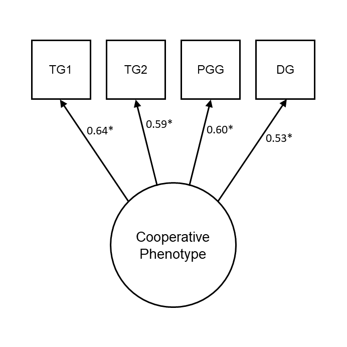

\renewcommand{\figurename}{Supplementary Figure}
\renewcommand{\tablename}{Supplementary Table}
\renewcommand{\thefigure}{\arabic{figure}} \setcounter{figure}{0}
\renewcommand{\thetable}{\arabic{table}} \setcounter{table}{0}
\renewcommand{\theequation}{\arabic{equation}} \setcounter{equation}{0}

# **Supplementary Information**

\setcounter{page}{1}
\centering
\noindent \footnotesize Cooperative phenotype predicts political views on hierarchy and redistribution eighteen months later \newline
\hspace*{8mm} \footnotesize Scott Claessens\textsuperscript{1}, Chris G Sibley\textsuperscript{1}, Ananish Chaudhuri\textsuperscript{2,3}, & Quentin D Atkinson\textsuperscript{1,4} \newline
\raggedright
\noindent \footnotesize \textsuperscript{1} School of Psychology, University of Auckland, New Zealand \newline
\noindent \footnotesize \textsuperscript{2} Department of Economics, University of Auckland, Auckland, New Zealand \newline
\noindent \footnotesize \textsuperscript{3} CESifo, Munich, Germany \newline
\noindent \footnotesize \textsuperscript{4} Max Planck Institute for the Science of Human History, Jena, Germany \newline
\normalsize
\newpage

## Supplementary Methods

### Procedure for economic game sessions

In both waves, participants were booked into sessions on midweek evenings and 
completed the session online in real-time. Session sizes varied between 14 and 
130 participants. Although participants knew they were completing the study with 
other participants from the New Zealand Attitudes and Values Study, they did not
know specifically who they were interacting with in the session or how many 
other people there were in the session.

Participants completed a consent form before proceeding to the eight 
behavioural tasks (three cooperation games described in the main text, plus 
additional tasks). In the first wave, all eight tasks were completed in a 
randomised order. In the second wave, the economic games shared with the first
wave were completed first in a randomised order, followed by two new tasks (the
rule following and social information use tasks) which were presented in a 
separately randomised order. For each task, participants read the instructions 
for the task, completed a comprehension question, and then proceeded to make 
their decisions.

After making their decisions for all the tasks, participants entered a waiting 
lobby in which they waited for all other participants in their session to 
complete the tasks. If participants took longer than 55 minutes to complete the 
tasks, they were skipped ahead to the waiting lobby. Timeouts were still paid 
their show-up fee, but not their bonus. In the first wave, participants took 
`r printnum(mean(d$egame.SecsAll.T10 / 60), digits = 0)` minutes on average to 
complete all eight tasks (SD = 
`r printnum(sd(d$egame.SecsAll.T10 / 60), digits = 0)` minutes, range = 
`r printnum(min(d$egame.SecsAll.T10 / 60), digits = 0)` - 
`r printnum(max(d$egame.SecsAll.T10 / 60), digits = 0)` 
minutes), and in the second wave, participants took 
`r printnum(mean(d$egame.SecsAll.T11 / 60), digits = 0)` 
minutes on average (SD = `r printnum(sd(d$egame.SecsAll.T11 / 60), digits = 0)` 
minutes, range = `r printnum(min(d$egame.SecsAll.T11 / 60), digits = 0)` - 
`r printnum(max(d$egame.SecsAll.T11 / 60), digits = 0)` minutes).

\newpage

## Supplementary Results

### Measurement invariance results

We tested for measurement invariance of the cooperative phenotype factor 
structure in a series of increasingly restrictive nested models. For all model 
comparisons, we pre-registered the use of changes in fit statistics as 
thresholds for diagnosing reduced model fit 
[$\Delta$Comparative Fit Index (CFI) < -0.01, $\Delta$Root Mean Square Error of 
Approximation (RMSEA) > 0.015] rather than $\chi^2$ differences which are 
sensitive to large sample sizes. To deal with non-independence of observations, 
all measurement invariance models had correlated item errors across waves.

First, we fitted a configural invariance model, which freely estimated the two 
latent variables simultaneously (Supplementary Table \@ref(tab:tableCompareMI)). 
As expected, this configural invariance model fitted the data well (CFI = 
`r printnum(fitMeasures(configMI)['cfi'])`, RMSEA = 
`r printnum(fitMeasures(configMI)['rmsea'])`) and all loadings were 
significantly positive. Second, we fitted a metric invariance model, which 
constrained the item loadings to equality across the two waves. Model fit did 
not substantially change ($\Delta$CFI = 
`r printnum(fitMeasures(metricMI)['cfi'] - fitMeasures(configMI)['cfi'], digits = 3)`, 
$\Delta$RMSEA = 
`r printnum(fitMeasures(metricMI)['rmsea'] - fitMeasures(configMI)['rmsea'], digits = 3)`). 
Third, we fitted a scalar invariance model, which constrained the item 
loadings, intercepts, and thresholds to equality across the two waves. Again, 
model fit did not substantially change ($\Delta$CFI = 
`r printnum(fitMeasures(scalarMI)['cfi'] - fitMeasures(metricMI)['cfi'], digits = 3)`, 
$\Delta$RMSEA = 
`r printnum(fitMeasures(scalarMI)['rmsea'] - fitMeasures(metricMI)['rmsea'], digits = 3)`).
Fourth, and finally, we fitted a strict invariance model, which constrained the 
item loadings, intercepts, thresholds, and variances to equality across waves. 
Model fit remained unchanged ($\Delta$CFI = 
`r printnum(fitMeasures(strictMI)['cfi'] - fitMeasures(scalarMI)['cfi'], digits = 3)`,
$\Delta$RMSEA = 
`r printnum(fitMeasures(strictMI)['rmsea'] - fitMeasures(scalarMI)['rmsea'], digits = 3)`).
Measurement invariance analysis thus supports strict invariance of the 
cooperative phenotype latent variable over time.

\newpage

## Supplementary Figures

(ref:timelinePlotCaption) _Data collection timeline for NZAVS Wave 10, NZAVS 
Wave 11, and both waves of economic game data collection (n = `r 
printnum(nrow(tar_read(d)))`)._ Each point is an individual participant. Note 
the break in data collection in February 2019 due to the Christchurch 
terrorist attack.

```{r timelinePlot, echo=FALSE, warning=F, message=F, fig.width=7, fig.height=5, fig.cap="(ref:timelinePlotCaption)"}
tar_read(timeline)
```

\newpage

(ref:plotObsCaption) _Bar plot showing proportions of observed data for all 
variables included in the study_. T10 = NZAVS Wave 10, T11 = NZAVS Wave 11.

```{r plotObs, echo=FALSE, warning=F, message=F, fig.width=6, fig.height=4, fig.cap="(ref:plotObsCaption)"}
tar_read(plotObs)
```

\newpage

(ref:impPlotCaption) _Density plots showing imputed values from 20 multiply 
imputed datasets (pink) against observed values (blue)._ Data were imputed 
using predictive mean matching.

```{r impPlot, echo=FALSE, warning=F, message=F, fig.width=16, fig.height=10, fig.cap="(ref:impPlotCaption)"}
tar_read(plotImputation)
```

\newpage

(ref:cfa1PlotCaption) _Confirmatory factor model for the cooperative 
phenotype in Wave 2._ TG1 is treated as a binary endogenous variable. Numbers 
are standardised coefficients. *_p_ < 0.05. TG1 = Trust Game (Give), TG2 = Trust 
Game (Return), PGG = Public Goods Game, DG = Dictator Game.

```{r cfa1Plot, echo=FALSE, warning=F, message=F, out.width="80%", fig.cap="(ref:cfa1PlotCaption)"}

```

\newpage

(ref:plotCorsCaption) _Zero-order correlations between game decisions in the 
first and second wave._ All _p_-values < 0.01. TG1 = Trust Game (Give), TG2 = 
Trust Game (Return), DG = Dictator Game, PGG = Public Goods Game.

```{r plotCors, echo=FALSE, warning=F, message=F, fig.width=7, fig.height=4, fig.cap="(ref:plotCorsCaption)"}
tar_read(plotCors)
```

\newpage

(ref:sem1PlotCaption) _Social Dominance Orientation (mean score) is 
negatively related to model-predicted cooperation latent variable scores in the
second wave._

```{r sem1Plot, echo=FALSE, warning=F, message=F, out.width="80%", fig.cap="(ref:sem1PlotCaption)"}
tar_read(plotSem1)
```

\newpage

(ref:clpmPlotBSDOCaption) _Results of cross-lagged panel model with the 
cooperative phenotype and SDO, analysing listwise-deleted data._ (a) 
Autoregressive effects, cross-lagged effects, and within-wave (residual) 
correlations from the model. Note that measurement models for the cooperative 
phenotype latent variables are omitted from this figure. Numbers are 
standardised coefficients, *_p_ < 0.05. (b, c) Forest plots visualising the 
change in cross-lagged paths when controlling for time-invariant covariates, 
individually and in a full model. Points are unstandardised estimates, lines 
are 95% confidence intervals.

```{r clpmPlotBSDO, echo=FALSE, warning=F, message=F, fig.width=6, fig.height=6, fig.cap="(ref:clpmPlotBSDOCaption)"}
tar_read(clpmPlotB_SDO)
```

\newpage

(ref:clpmPlotAIncRedCaption) _Results of cross-lagged panel model with the
cooperative phenotype and support for income redistribution, pooling over 20
imputed datasets._ (a) Autoregressive effects, cross-lagged effects, and 
within-wave (residual) correlations from the model. Support for income 
redistribution is treated as ordinal. Note that measurement models for the 
cooperative phenotype latent variables are omitted from this figure. Numbers are 
standardised coefficients, *_p_ < 0.05. (b, c) Forest plots visualising the 
change in cross-lagged paths when controlling for time-invariant covariates, 
individually and in a full model. Points are unstandardised estimates, lines are 
95% confidence intervals. 

```{r clpmPlotAIncRed, echo=FALSE, warning=F, message=F, fig.width=6, fig.height=6, fig.cap="(ref:clpmPlotAIncRedCaption)"}
tar_read(clpmPlotA_IncRed)
```

\newpage

(ref:clpmPlotBIncRedCaption) _Results of cross-lagged panel model with the
cooperative phenotype and support for income redistribution, analysing
listwise-deleted data._ (a) Autoregressive effects, cross-lagged effects, and 
within-wave (residual) correlations from the model. Support for income 
redistribution is treated as ordinal. Note that measurement models for the 
cooperative phenotype latent variables are omitted from this figure. Numbers are 
standardised coefficients, *_p_ < 0.05. (b, c) Forest plots visualising the 
change in cross-lagged paths when controlling for time-invariant covariates, 
individually and in a full model. Points are unstandardised estimates, lines are 
95% confidence intervals. 

```{r clpmPlotBIncRed, echo=FALSE, warning=F, message=F, fig.width=6, fig.height=6, fig.cap="(ref:clpmPlotBIncRedCaption)"}
tar_read(clpmPlotB_IncRed)
```

\newpage

(ref:clpmPlotAIncAttCaption) _Results of cross-lagged panel model with the
cooperative phenotype and income attribution beliefs, pooling over 20 imputed
datasets._ (a) Autoregressive effects, cross-lagged effects, and within-wave 
(residual) correlations from the model. Income attribution beliefs are treated 
as ordinal. Note that measurement models for the cooperative phenotype latent 
variables are omitted from this figure. Numbers are standardised coefficients, 
*_p_ < 0.05. (b, c) Forest plots visualising the change in cross-lagged paths 
when controlling for time-invariant covariates, individually and in a full 
model. Points are unstandardised estimates, lines are 95% confidence intervals. 

```{r clpmPlotAIncAtt, echo=FALSE, warning=F, message=F, fig.width=6, fig.height=6, fig.cap="(ref:clpmPlotAIncAttCaption)"}
tar_read(clpmPlotA_IncAtt)
```

\newpage

(ref:clpmPlotBIncAttCaption) _Results of cross-lagged panel model with the
cooperative phenotype and income attribution beliefs, analysing listwise-deleted
data._ (a) Autoregressive effects, cross-lagged effects, and within-wave 
(residual) correlations from the model. Income attribution beliefs are treated 
as ordinal. Note that measurement models for the cooperative phenotype latent 
variables are omitted from this figure. Numbers are standardised coefficients, 
*_p_ < 0.05. (b, c) Forest plots visualising the change in cross-lagged paths 
when controlling for time-invariant covariates, individually and in a full 
model. Points are unstandardised estimates, lines are 95% confidence intervals. 

```{r clpmPlotBIncAtt, echo=FALSE, warning=F, message=F, fig.width=6, fig.height=6, fig.cap="(ref:clpmPlotBIncAttCaption)"}
tar_read(clpmPlotB_IncAtt)
```

\newpage

(ref:clpmPlotAPolNatCaption) _Results of cross-lagged panel model with the
cooperative phenotype and support for the National Party, pooling over 20
imputed datasets._ (a) Autoregressive effects, cross-lagged effects, and 
within-wave (residual) correlations from the model. Support for the National 
Party is treated as ordinal. Note that measurement models for the cooperative 
phenotype latent variables are omitted from this figure. Numbers are 
standardised coefficients, *_p_ < 0.05. (b, c) Forest plots visualising the 
change in cross-lagged paths when controlling for time-invariant covariates, 
individually and in a full model. Points are unstandardised estimates, lines are 
95% confidence intervals.

```{r clpmPlotAPolNat, echo=FALSE, warning=F, message=F, fig.width=6, fig.height=6, fig.cap="(ref:clpmPlotAPolNatCaption)"}
tar_read(clpmPlotA_PolNat)
```

\newpage

(ref:clpmPlotBPolNatCaption) _Results of cross-lagged panel model with the
cooperative phenotype and support for the National Party, analysing
listwise-deleted data._ (a) Autoregressive effects, cross-lagged effects, and 
within-wave (residual) correlations from the model. Support for the National 
Party is treated as ordinal. Note that measurement models for the cooperative 
phenotype latent variables are omitted from this figure. Numbers are 
standardised coefficients, *_p_ < 0.05. (b, c) Forest plots visualising the 
change in cross-lagged paths when controlling for time-invariant covariates, 
individually and in a full model. Points are unstandardised estimates, lines are 
95% confidence intervals.

```{r clpmPlotBPolNat, echo=FALSE, warning=F, message=F, fig.width=6, fig.height=6, fig.cap="(ref:clpmPlotBPolNatCaption)"}
tar_read(clpmPlotB_PolNat)
```

\newpage

## Supplementary Tables

(ref:biasTableCaption) Results of linear models estimating the differences in 
key variables between participants who dropped out (n = 414) and participants 
who completed both waves of data collection (n = 631). All models show no 
significant differences between dropouts and non-dropouts, suggesting that our 
sample was not systematically biased by retention.

```{r biasTable, echo=F, warning=F, message=F}
apa_table(
  tar_read(biasTable),
  placement = "H",
  caption = "(ref:biasTableCaption)"
)
```

\newpage

(ref:itemTableCaption) Self-report items from the New Zealand Attitudes and 
Values Study.

```{r itemTable, echo=F, warning=F, message=F}
apa_table(
  tar_read(itemTable),
  longtable = TRUE,
  landscape = TRUE,
  font_size = "footnotesize",
  placement = "H",
  #align = c("p{5cm}", "p{14cm}", "p{1cm}"),
  caption = "(ref:itemTableCaption)"
)
```

\newpage

(ref:diffTableCaption) Results of multilevel models estimating the differences
in game behaviour between the two waves. There are no significant differences
between waves for the Trust Game and the Public Goods Game. In the Dictator
Game, participants give 2 fewer points (out of 100) in the second wave, on 
average.

```{r diffTable, echo=F, warning=F, message=F}
apa_table(
  tar_read(diffTable),
  placement = "H",
  caption = "(ref:diffTableCaption)"
)
```

\newpage

(ref:tableCompareMICaption) _Measurement invariance analysis of the cooperative 
phenotype latent variable supports strict measurement invariance._ CFI = 
Comparative Fit Index; RMSEA = Root Mean Square Error of Approximation; SRMR = 
Standardised Root Mean Square Residual.

```{r tableCompareMI, echo=F, message=F, warning=F}
apa_table(
  tar_read(tableCompareMI), 
  format = "latex", 
  escape = FALSE,
  booktabs = TRUE,
  placement = "H",
  caption = "(ref:tableCompareMICaption)"
  )
```
