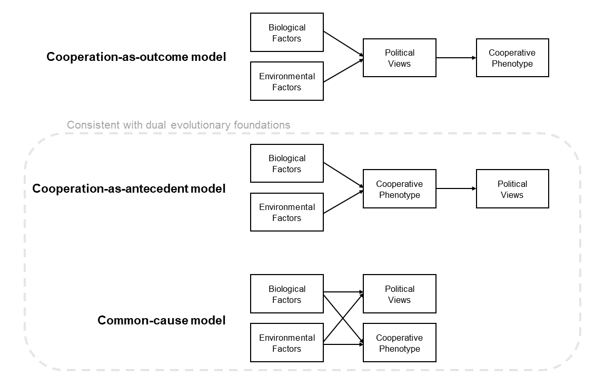

\linenumbers

# Introduction

People vary in their political voting patterns, policy views, and party support. A central aim of political psychology has been to understand the sources of this ideological variation. In order to study the antecedents of ideology, political psychologists have traditionally used self-report measures that ask people to explicitly state their political opinions, party preferences, and prejudices [@Duckitt2009]. However, some have argued that, due to issues like social desirability and experimenter demand, self-report measures do not fully capture the political mind [@Burdein2006; @Gawronski2015]. As such, recent work has begun to explore the relationships between political ideology and behaviour in incentivised economic games [@Fischer2021]. Economic games (_i.e._, social decision-making tasks that involve real money) are tools that elicit private behavioural preferences, such as a willingness to share, while avoiding the desirability issues that plague self-report methods [@Pisor2020]. It costs nothing to state a willingness to share on paper, but economic games require people to put their money where their mouth is [@Chaudhuri2008].

Over the past decade, research using economic games has revealed robust correlations between political ideology and cooperative behaviour. For example, people higher in Social Dominance Orientation (SDO), an ideological measure of support for hierarchy and dominance, tend to share less money in a variety of social dilemma games that pit self-interest against collective-interest [@Haesevoets2015; @Haesevoets2018; @Halali2018]. A recent meta-analysis of data from over 3,000 participants found a reliable negative correlation between SDO and measures of cooperative behaviour, with a small-to-medium effect size [@Thielmann2020]. Extending this work, @Claessens2023 found that, after controlling for socio-demographic variables and Right Wing Authoritarianism (RWA; an ideological measure of norm-adherence and group conformity), SDO was negatively correlated with a "cooperative phenotype" latent variable. This latent variable is a general behavioural disposition for cooperation that is uncovered via a battery of economic games measuring people's willingness to share resources at a cost to oneself [@Peysakhovich2014].

If political ideology and the cooperative phenotype are correlated, this raises the question of how and if they causally influence one another. At least three causal models are compatible with a cross-sectional correlation between political ideology and the cooperative phenotype.

Prior work has tended to adopt a _cooperation-as-outcome_ model. Under this model, biological and environmental factors interact to produce political ideology [@Duckitt2009] and political ideology then influences how people behave in economic games. In short, ideology causes behaviour. This causal model is often assumed _a priori_ to explain cross-sectional correlations between ideology and behaviour. For example, @Grunhage2020 write that "political orientation _predisposes for_ a more trusting or cooperative behavior" (italics added; p. 22).

Alternatively, under the _cooperation-as-antecedent_ model, biological and environmental factors interact to produce the behavioural predispositions captured by economic games, and these behavioural predispositions influence the expression of political ideology. In short, behavioural predispositions cause ideology. This causal model is uniquely predicted by the dual evolutionary framework of political ideology [@Claessens2020], which explains ideology as shaped in part by basic social drives that were favoured during human evolution. Human group living evolved via two key shifts [@Tomasello2012]; a shift towards increased cooperation with others, and a shift towards conformity to and enforcement of group-wide social norms. According to the dual evolutionary framework, variation in general drives for cooperation and group conformity arises from the interaction between heritable individual differences and socio-ecological environments. These general drives for cooperation and group conformity, together with individuals' immediate social context, produce variation in two dimensions of political ideology, often referred to as economic and social ideology [@Claessens2020]. This causal pathway --- from behavioural predispositions to politics --- is captured by @VanLange2012, who write that "political preferences and voting are _partially rooted in_ interpersonal orientations" (italics added; p. 469).

Both the cooperation-as-outcome and cooperation-as-antecedent models predict different directions of causation between behaviour and ideology. In contrast, the _common-cause_ model predicts that both behaviour and ideology are caused by the same biological and environmental factors, but do not directly influence one another over time. This alternative model is inspired by recent longitudinal evidence showing that personality does not causally precede political ideology, as predicted by the dual process model of ideology [@Duckitt2009]  but instead personality and political ideology covary in parallel, likely due to common causes from biological and environmental factors [@Verhulst2012; @Osborne2020]. Similarly, the common-cause model predicts that political ideology and the cooperative phenotype will be correlated, not because they influence one another over time, but because they share the same biological and environmental causes. This model is also consistent with the dual evolutionary framework of political ideology, insofar as heritable individual differences and socio-ecological environments influence both cooperative behaviour and political ideology simultaneously.

Figure \@ref(fig:theoreticalModels) provides an overview of these causal models. All three of these models predict a cross-sectional correlation between political ideology and cooperative behaviour. As such, previous cross-sectional work [@Haesevoets2015; @Haesevoets2018; @Halali2018; @Claessens2023] cannot distinguish between these models. Previous longitudinal work has shown that cooperative dispositions predict voting outcomes four weeks and eight months later [@VanLange2012] but, without a concurrent measure of political ideology, this result is unable to distinguish between the cooperation-as-antecedent and common-cause models. 

(ref:theoreticalModelsFigCaption) At least three theoretical causal models are compatible with the cross-sectional correlation between political ideology and the cooperative phenotype.

```{r theoreticalModels, echo=F, fig.cap = "(ref:theoreticalModelsFigCaption)", out.width = "\\textwidth"}

```

Longitudinal panel data allows us to provide some additional insights and generate specific hypotheses. If the cooperation-as-outcome model is correct, then political ideology at time _t_ should predict the cooperative phenotype at time _t + 1_, but the cooperative phenotype at time _t_ should be unrelated to political ideology at time _t + 1_. If the cooperation-as-antecedent model is correct, the opposite should be true: the cooperative phenotype at time _t_ should predict political ideology at time _t + 1_, but political ideology at time _t_ should be unrelated to the cooperative phenotype at time _t + 1_. Finally, if the common cause model is correct, we expect the cooperative phenotype and political ideology to be correlated within time-points, but the cooperative phenotype (political ideology) at time _t_ should be unrelated to political ideology (cooperative phenotype) at time _t + 1_.

Here, we test these hypotheses using a pre-registered cross-lagged longitudinal panel design with two time-points separated by eighteen months. We estimate the directions of causality between the cooperative phenotype, Social Dominance Orientation, views on economic issues, and political party support. Cross-lagged panel models are commonly used in political psychology to study the antecedents and outcomes of political ideology. Previous research using this method has shown that SDO is temporally preceded by a competitive worldview [@Sibley2007; @Sibley2013] and predicts future prejudice [@Asbrock2010], nationalism [@Osborne2017], economic policy views [@Sibley2010a], and political party support [@Satherley2020]. Extending this previous research to include behavioural measures, we test whether the cooperative phenotype is an antecedent, outcome, or cross-sectional correlate of Social Dominance Orientation, views on economic issues, and party support over time.

# Methods

## Ethical approval

Ethical approval was granted by REDACTED (ref: 021666). The study was performed in accordance with all the relevant guidelines and regulations. Informed consent was obtained from all participants prior to the study.

## Participants and sampling

```{r echo=F}
tar_load(d)
```

Participants were sampled from the New Zealand Attitudes and Values Study (NZAVS), an annual longitudinal self-report study that has been active since 2009. This participant pool is initially contacted by the NZAVS through random draws from the New Zealand electoral roll. NZAVS participants from an initial sample frame (n = 3,345) were contacted in 2019 with an invitation to participate in an additional economic game study [@Claessens2023]. 1045 participated in the first wave of economic game data collection in 2019, were successfully paid for the study, and did not time out of their session. In the second wave in 2020, this sample size dropped to 631 (60% retention rate). We only analysed data from participants that completed both waves of economic game data collection (n = `r nrow(d)`; `r printnum(sum(d$Gender.T10 == 0, na.rm = T))` females; mean age = `r printnum(mean(d$Age.T10, na.rm = T), digits = 0)` years; age range = `r printnum(min(d$Age.T10, na.rm = T), digits = 0)` - `r printnum(max(d$Age.T10, na.rm = T), digits = 0)` years). This sample size was the largest available to us from our sample frame and was not determined through a formal power analysis.

## Materials

### Self-report measures

Main self-report measures were taken from Waves 10 and 11 of the NZAVS. The primary measures of interest for this study were: Social Dominance Orientation [@Pratto1994]; support for income redistribution ("redistributing money and wealth more evenly among a larger percentage of the people in New Zealand through heavy taxes on the rich"); income attribution ("if incomes were more equal, people would be less motivated to work hard"); and support for New Zealand's centre-right National Party. We chose these measures because they all exhibited cross-sectional correlations with the cooperative phenotype in previous research [@Claessens2023]. Other time-invariant covariates were taken from Wave 10 of the NZAVS: age, gender, ethnicity, education, local deprivation, socio-economic status, religiosity, and RWA. See Supplementary Table \@ref(tab:itemTable) for full list of self-report items.

### Battery of economic games

Across two waves of data collection, participants completed three incentivised one-shot economic games, conducted online in real-time using oTree software [@Chen2016]. These games measure cooperative behaviour and are largely identical to the cooperation games used in @Peysakhovich2014. We used the strategy method to elicit responses in all possible roles. Participants played for points, which were converted to New Zealand dollars (1 point = $0.035).

The three cooperation games are as follows:

- _Dictator Game_. Player A is given 100 points. They must decide how many of these points to transfer to Player B. Player A keeps the remaining points. Player B is passive in the interaction.
- _Trust Game_. Players A and B both start with 50 points. First, Player A decides whether or not to transfer all 50 points to Player B, in the knowledge that the transferred amount will be tripled to 150 points. If Player A transfers, Player B now has 200 points. Player B must then decide to transfer 0 - 150 points back to Player A. There are thus two decisions in this game: giving and returning.
- _Public Goods Game_. Four players begin with 100 points each. They can contribute 0 - 100 points into a shared group project. All four decisions are made simultaneously, and then the amount in the group project is doubled and distributed evenly between all four players. Each player ends the game with their share from the group project, plus the points they initially refrained from contributing.

In both waves of economic game data collection, participants also completed additional punishment games (Ultimatum Game, Third Party Punishment Game, and Second Party Punishment Game). Moreover, in the first wave, participants completed additional coordination games and, in the second wave, participants completed additional behavioural measures of rule following and social information use [@Claessens2023]. Since our focus in this study is on the cooperative phenotype, these behavioural tasks were not included in the analyses.

## Procedure

The NZAVS collects self-report data both online and via paper surveys posted to participants. In Wave 10 of the study, most of the data were collected between November 2018 and September 2019, and in Wave 11 of the study, most of the data were collected between October 2019 and November 2020 (see Supplementary Figure \@ref(fig:timelinePlot) for timeline).

Data collection for the first wave of economic games was conducted between 18^th^ February and 25^th^ July 2019, and data collection for the second wave was conducted between 19^th^ October and 11^th^ November 2020. In both waves, participants were booked into sessions on midweek evenings and completed the session online in real-time. Session sizes varied between 14 and 130 participants. Although participants knew they were completing the study with other NZAVS participants, they did not know specifically who they were interacting with in the session or how many other people there were in the session.

Participants completed a consent form before proceeding to the eight behavioural tasks (three cooperation games plus additional tasks). In the first wave, all eight tasks were completed in a randomised order. In the second wave, the economic games shared with the first wave were completed first in a randomised order, followed by the two new tasks which were presented in a separately randomised order. For each task, participants read the instructions for the task, completed a comprehension question, and then proceeded to make their decisions.

After the tasks, participants entered a waiting lobby in which they waited for all other participants in their session to complete the tasks. If participants took longer than 55 minutes to complete the tasks, they were skipped ahead to the waiting lobby. Timeouts were still paid their show-up fee, but not their bonus. In the first wave, participants took `r printnum(mean(d$egame.SecsAll.T10 / 60), digits = 0)` minutes on average to complete all eight tasks (SD = `r printnum(sd(d$egame.SecsAll.T10 / 60), digits = 0)` minutes, range = `r printnum(min(d$egame.SecsAll.T10 / 60), digits = 0)` - `r printnum(max(d$egame.SecsAll.T10 / 60), digits = 0)` minutes), and in the second wave, participants took `r printnum(mean(d$egame.SecsAll.T11 / 60), digits = 0)` minutes on average (SD = `r printnum(sd(d$egame.SecsAll.T11 / 60), digits = 0)` minutes, range = `r printnum(min(d$egame.SecsAll.T11 / 60), digits = 0)` - `r printnum(max(d$egame.SecsAll.T11 / 60), digits = 0)` minutes).

The computer randomly matched participants into groups to determine their bonus payment from the session. Participants were paid a \$20 NZD show-up fee, plus their bonus payment. In the first wave, participants earned a bonus payment of \$`r printnum(mean(d$egame.Paid.T10 - 20))` on average (SD = \$`r printnum(sd(d$egame.Paid.T10 - 20))`). In the second wave, participants earned a bonus payment of \$`r printnum(mean(d$egame.Paid.T11 - 20))` on average (SD = \$`r printnum(sd(d$egame.Paid.T11 - 20))`).

## Pre-registration

We pre-registered our hypotheses on the Open Science Framework (https://osf.io/ksw3x/?view_only=597d9d552bc142f4a6d59e4eba97b425) before running the second wave of economic game data collection. First, we hypothesised that the cooperation games in the second wave would all load onto a single latent variable, replicating our previous work [@Claessens2023]. Second, we hypothesised that this "cooperative phenotype" would be negatively related to SDO within the second wave, again replicating our previous work. Third, we hypothesised that the cooperative phenotype latent variable would have at least scalar measurement invariance across waves, providing further evidence for its stability over time [@Carlsson2014; @Peysakhovich2014]. Fourth, we predicted that our longitudinal models would provide support for at least one of the causal models visualised in Figure \@ref(fig:theoreticalModels).

## Statistical analysis

We used confirmatory factor analysis and structural equation modelling to test our pre-registered hypotheses. For measurement invariance analyses, we fitted a confirmatory factor analysis model with correlated item errors across waves to deal with non-independence of observations. For our longitudinal modelling, we used two-wave two-variable cross-lagged panel models. To deal with missing data across waves when analysing self-report items, we used multiple imputation with predictive mean matching [@R-mice], pooling our estimates across 20 imputed datasets. Visual inspection confirmed the plausibility of imputed values (see Supplementary Figure \@ref(fig:impPlot)).

## Transparency and openness

Since the NZAVS is an ongoing longitudinal study, ethical concerns prevent us from making the dataset from this study publicly available. However, data are available on request from the lead author. Pre-registration, analysis plan, R code for analyses, and Python code for the economic games are available at https://osf.io/ksw3x/?view_only=597d9d552bc142f4a6d59e4eba97b425. All analyses were conducted in R version 4.2.1 [@R-base] using the _lavaan_ package [@R-lavaan]. Figures were created using _ggraph_ [@R-ggraph], _cowplot_ [@R-cowplot], and _ggplot2_ [@R-ggplot2] packages, multiple imputation was implemented using the _mice_ package [@R-mice], reproducibility of all analyses was ensured by using the _targets_ package [@R-targets], and the manuscript was generated using the _papaja_ package [@R-papaja].

# Results

```{r echo=F, message=F, warning=F, results="hide"}
tar_load(cfa1)
tar_load(sem1)
s <- data.frame(summary(sem1, ci = TRUE))
```

In the first step of our pre-registered analyses, we focused solely on the second wave of data in order to replicate our previous findings from the first wave [@Claessens2023]. First, we fitted a confirmatory factor analysis model with the Trust Game (Give), Trust Game (Return), Dictator Game, and Public Goods Game loading onto a "cooperative phenotype" latent variable. Supporting our first pre-registered hypothesis, all factor loadings were significantly positive (_p_ < 0.05) and the model fitted the data well (CFI = `r printnum(as.numeric(fitMeasures(cfa1)['cfi']))`, RMSEA = `r printnum(as.numeric(fitMeasures(cfa1)['rmsea']))`, SRMR = `r printnum(as.numeric(fitMeasures(cfa1)['srmr']))`; Figure \@ref(fig:impPlot)) according to established fit statistic cutoffs [@Hu1999; @MacCallum1996]. Second, we fitted a structural equation model with SDO as the sole predictor of the cooperative phenotype latent variable. Supporting our second pre-registered hypothesis, we found that SDO significantly negatively predicted the cooperative phenotype (unstandardised _b_ = `r printnum(s[5,5])`, 95% confidence interval [`r printnum(s[5,10])` `r printnum(s[5,11])`], _p_ `r printp(s[5,9])`; Figure \@ref(fig:sem1Plot)). These findings replicate our previous work with the same sample of participants eighteen months later [@Claessens2023].

```{r echo=F, message=F, warning=F, results="hide"}
tar_load(configMI)
tar_load(metricMI)
tar_load(scalarMI)
tar_load(strictMI)
```

In the next step of our pre-registered analyses, we tested the measurement invariance of the cooperative phenotype latent variable across the two waves. Longitudinal measurement invariance testing ensures that latent factor structures are stable over time, an important prerequisite to cross-lagged panel modelling. We tested for measurement invariance of the cooperative phenotype factor structure in a series of increasingly restrictive nested models [@vanDeSchoot2012]. For all model comparisons, we pre-registered the use of changes in fit statistics as thresholds for diagnosing reduced model fit [$\Delta$Comparative Fit Index (CFI) < -0.01, $\Delta$Root Mean Square Error of Approximation (RMSEA) > 0.015; @Chen2007] rather than $\chi^2$ differences which are sensitive to large sample sizes. To deal with non-independence of observations, all measurement invariance models had correlated item errors across waves.

First, we fitted a configural invariance model, which freely estimated the two latent variables simultaneously (Table \@ref(tab:tableCompareMI)). As expected, this configural invariance model fitted the data well (CFI = `r printnum(fitMeasures(configMI)['cfi'])`, RMSEA = `r printnum(fitMeasures(configMI)['rmsea'])`) and all loadings were significantly positive. Second, we fitted a metric invariance model, which constrained the item loadings to equality across the two waves. Model fit did not substantially change ($\Delta$CFI = `r printnum(fitMeasures(metricMI)['cfi'] - fitMeasures(configMI)['cfi'], digits = 3)`, $\Delta$RMSEA = `r printnum(fitMeasures(metricMI)['rmsea'] - fitMeasures(configMI)['rmsea'], digits = 3)`). Third, we fitted a scalar invariance model, which constrained the item loadings, intercepts, and thresholds to equality across the two waves. Again, model fit did not substantially change ($\Delta$CFI = `r printnum(fitMeasures(scalarMI)['cfi'] - fitMeasures(metricMI)['cfi'], digits = 3)`, $\Delta$RMSEA = `r printnum(fitMeasures(scalarMI)['rmsea'] - fitMeasures(metricMI)['rmsea'], digits = 3)`). Fourth, and finally, we fitted a strict invariance model, which constrained the item loadings, intercepts, thresholds, and variances to equality across waves. Model fit remained unchanged ($\Delta$CFI = `r printnum(fitMeasures(strictMI)['cfi'] - fitMeasures(scalarMI)['cfi'], digits = 3)`, $\Delta$RMSEA = `r printnum(fitMeasures(strictMI)['rmsea'] - fitMeasures(scalarMI)['rmsea'], digits = 3)`). Measurement invariance analysis thus supports strict invariance of the cooperative phenotype latent variable over time, suggesting that the cooperative phenotype exhibits sufficient test-retest reliability and is stable over eighteen months within the same individuals.

(ref:tableCompareMICaption) _Measurement invariance analysis of the cooperative phenotype latent variable supports strict measurement invariance._ CFI = Comparative Fit Index; RMSEA = Root Mean Square Error of Approximation; SRMR = Standardised Root Mean Square Residual.

```{r tableCompareMI, echo=F, message=F, warning=F}
apa_table(
  tar_read(tableCompareMI), format = "latex", escape = FALSE,
  booktabs = TRUE, caption = "(ref:tableCompareMICaption)"
  )
```

Having established measurement invariance for the cooperative phenotype latent variable across waves, we then proceeded to fit our pre-registered two-variable two-wave cross-lagged panel models. For these models, we continued to constrain item loadings, intercepts, thresholds, and variances for the cooperative phenotype factor across waves, and also continued to correlate item errors across waves. Additionally, we included auto-regressive paths, cross-lagged paths, and within-wave covariances to form the structural component of the cross-lagged panel model.

```{r echo=F, warning=F, message=F, results='hide'}
tar_load(clpm1.01)
s <- as.data.frame(summary(clpm1.01, ci = TRUE))
```

We first fitted our primary cross-lagged panel model, modelling the relationship between SDO and the cooperative phenotype over time (Figure \@ref(fig:clpmPlotSDO)a). We found significantly positive auto-regressive effects: SDO in the first wave predicted SDO in the second wave (standardised $\beta$ = `r printnum(standardizedSolution(clpm1.01)[34,5])`, unstandardised _b_ = `r printnum(s[34,5])`, 95% CI [`r printnum(s[34,10])` `r printnum(s[34,11])`], _p_ `r printp(s[34,9])`) and the cooperative phenotype in the first wave predicted the cooperative phenotype in the second wave ($\beta$ = `r printnum(standardizedSolution(clpm1.01)[31,5])`, _b_ = `r printnum(s[31,5])`, 95% CI [`r printnum(s[31,10])` `r printnum(s[31,11])`], _p_ `r printp(s[31,9])`). Additionally, we found that the cooperative phenotype in the first wave negatively predicted SDO in the second wave ($\beta$ = `r printnum(standardizedSolution(clpm1.01)[33,5])`, _b_ = `r printnum(s[33,5])`, 95% CI [`r printnum(s[33,10])` `r printnum(s[33,11])`], _p_ = `r printp(s[33,9])`), but SDO did not predict later cooperation ($\beta$ = `r printnum(standardizedSolution(clpm1.01)[32,5])`, _b_ = `r printnum(s[32,5])`, 95% CI [`r printnum(s[32,10])` `r printnum(s[32,11])`], _p_ = `r printp(s[32,9])`). These cross-lagged paths were significantly different from one another (difference in unstandardised estimates = `r printnum(s[47,5])`, 95% CI [`r printnum(s[47,10])` `r printnum(s[47,11])`], _p_ = `r printp(s[47,9])`). 

```{r echo=F, warning=F, message=F, results='hide'}
tar_load(clpm1_gender)
tar_load(clpm1_ethnic)
s1 <- as.data.frame(summary(clpm1_gender, ci = TRUE))
s2 <- as.data.frame(summary(clpm1_ethnic, ci = TRUE))
```

To assess the robustness of the cross-lagged effect from the cooperative phenotype to later political ideology, we ran additional cross-lagged panel models statistically controlling for a wide range of time-invariant covariates: age, gender, ethnicity, education level, socio-economic status, local deprivation, religiosity, and RWA (Figures \@ref(fig:clpmPlotSDO)b and \@ref(fig:clpmPlotSDO)c). The cross-lagged path from the cooperative phenotype to later SDO remained significantly negative when controlling for most demographics, but was attenuated when controlling for gender and ethnicity. Given these results, we ran exploratory multi-group cross-lagged panel models with separate groups for (1) male and female participants, and (2) participants of European ancestry and participants not of European ancestry (due to small sample sizes in individual Asian, Māori, and Pacific groups). These follow-up models revealed that the cross-lagged path from the cooperative phenotype to later SDO was significantly negative for males ($\beta$ = `r printnum(standardizedSolution(clpm1_gender)[79,6])`, _b_ = `r printnum(s1[79,7])`, 95% CI [`r printnum(s1[79,12])` `r printnum(s1[79,13])`], _p_ = `r printp(s1[79,11])`) but not for females ($\beta$ = `r printnum(standardizedSolution(clpm1_gender)[33,6])`, _b_ = `r printnum(s1[33,7])`, 95% CI [`r printnum(s1[33,12])` `r printnum(s1[33,13])`], _p_ = `r printp(s1[33,11])`), though these were both in the same direction. Similarly, the cross-lagged path from the cooperative phenotype to later SDO was significantly negative for participants of European ancestry ($\beta$ = `r printnum(standardizedSolution(clpm1_ethnic)[79,6])`, _b_ = `r printnum(s2[79,7])`, 95% CI [`r printnum(s2[79,12])` `r printnum(s2[79,13])`], _p_ = `r printp(s2[79,11])`) but not for other participants ($\beta$ = `r printnum(standardizedSolution(clpm1_ethnic)[33,6])`, _b_ = `r printnum(s2[33,7])`, 95% CI [`r printnum(s2[33,12])` `r printnum(s2[33,13])`], _p_ = `r printp(s2[33,11])`), though these were both in the same direction.

(ref:clpmPlotSDOCaption) _The cooperative phenotype negatively predicts later SDO._ (a) Cross-lagged panel model with the cooperative phenotype and SDO. Note that measurement models for the cooperative phenotype latent variables are omitted from this figure. Numbers are standardised coefficients, *_p_ < 0.05. (b, c) Forest plots visualising the change in cross-lagged paths when controlling for time-invariant covariates, individually and in a full model. Points are unstandardised estimates, lines are 95% confidence intervals.

```{r clpmPlotSDO, echo=FALSE, warning=F, message=F, fig.width=6, fig.height=6, fig.cap="(ref:clpmPlotSDOCaption)"}
tar_read(clpmPlot_SDO)
```

To assess the generalisability of the cross-lagged effect from the cooperative phenotype to later political ideology, we swapped out SDO in our cross-lagged panel model for additional measures of views on economic issues and political party support. As these additional measures were single Likert scale items, we treated them as ordered variables in our modelling. When we included support for income redistribution in the model instead of SDO, we found the same pattern of results: the cooperative phenotype positively predicted future support for income redistribution, but support for income redistribution did not predict future cooperation (Supplementary Figure \@ref(fig:clpmPlotIncRed)a). This pattern of results held when controlling for all demographics controls except gender, ethnicity, and religiosity (Supplementary Figures \@ref(fig:clpmPlotIncRed)b and \@ref(fig:clpmPlotIncRed)c). However, when we included income attribution views and support for New Zealand's centre-right National Party in the model instead of SDO, we found no cross-lagged effects over time (Supplementary Figures \@ref(fig:clpmPlotIncAtt) and \@ref(fig:clpmPlotPolNat)). Nevertheless, the within-wave correlations in these models were in the expected direction, with the cooperative phenotype negatively covarying cross-sectionally with both income attribution views and support for the National Party.

# Discussion

In a cross-lagged longitudinal analysis of cooperative behaviour and self-reported political attitudes, we have shown that the cooperative phenotype predicts SDO a year and a half later, but SDO does not predict future variation in the cooperative phenotype. This result is in line with the cooperation-as-antecedent model (Figure \@ref(fig:theoreticalModels)) which posits that general behavioural predispositions like the cooperative phenotype causally influence political ideology, but not vice versa. This causal model explains previously reported negative cross-sectional correlations between cooperation and SDO [@Haesevoets2015; @Haesevoets2018; @Halali2018; @Thielmann2020; @Claessens2023] as arising from a causal relationship from behavioural preferences to later political ideology.

```{r echo=FALSE}
# calculate difference in SDO
d$SDOdiff <- d$T10.SDO - d$T11.SDO
# two groups
d$group <- ifelse(
  as.character(d$EthnicCats.T10) == "Pakeha" & d$Gender.T10 == 1, 
  "Pakeha males", "Others"
  )
d$group <- ifelse(!is.na(d$group), d$group, "Others")
# variance in sdo difference
varPakehaMales <- var(d$SDOdiff[d$group == "Pakeha males"], na.rm = TRUE)
varOthers <- var(d$SDOdiff[d$group == "Others"], na.rm = TRUE)
# levene's test
levene <- leveneTest(SDOdiff ~ factor(group), data = d)
```

Additionally, the cross-lagged path from cooperation to future SDO was robust to a wide range of time-invariant socio-demographic covariates, including variables known to covary with SDO, such as education, socio-economic status, and RWA [@Sidanius1996; @Pratto1994; @Sidanius2000]. However, this cross-lagged path was attenuated when controlling for gender and ethnicity. In particular, exploratory analyses revealed that the cross-lagged effect held only for male participants of European ancestry. This is similar to the finding that upper body strength is related to support for inequality in males, but not females [@Petersen2019]. A possible evolutionary explanation for this effect of gender might be that humans have large sexual dimorphism in strength and formidability, and so reductions in the cooperative phenotype are more likely to result in dominative and competitive tactics for resource distribution specifically among males. But this does not explain the effect of ethnicity. Perhaps a simpler explanation is that SDO is generally higher among males and people from dominant ethnic groups [@Pratto1994; @Sidanius1994; @Sidanius2000]. Among these participants, there is potentially more room for a change in SDO over time, whereas female participants from minority ethnic groups may have already hit the floor of the scale and therefore have less room for change. In line with this explanation, when we look at the differences in SDO between the two waves, we find that these difference scores have a higher variance for males of European ancestry (variance = `r round(varPakehaMales, 2)`) compared to other participants (variance = `r round(varOthers, 2)`; Levene's test, _F_(`r levene$Df[1]`,`r levene$Df[2]`) = `r printnum(levene[["F value"]][1])`, _p_ `r printp(levene[["Pr(>F)"]][1])`) suggesting that SDO had more room for change over time among males of European ancestry. Future research should disentangle the roles of gender and ethnicity in the causal relationship between behavioural predispositions and political ideology.

When we generalised our cross-lagged analysis to other measures of economic ideology, we found more mixed results. As expected, the cooperative phenotype positively predicted future support for income redistribution, but cooperation was not longitudinally related to support for the centre-right National Party, nor was it longitudinally related to income attribution beliefs. One potential explanation for these null findings is that party affiliation and income attribution beliefs are generally less amenable to change over time: people rarely shift their political party affiliation [@PewResearchCenter2020] and income attribution beliefs have been characterised as a stable individual difference [@Osborne2015; but see @Piff2020 for evidence that active interventions can shift income attribution beliefs over a five-month period]. Nevertheless, support for the National Party and income attribution beliefs were negatively related to the cooperative phenotype _within_ waves, which supports the common-cause model (Figure \@ref(fig:theoreticalModels)). This model posits that the cooperative phenotype and political ideology covary due to shared causes from common biological and environmental influences.

Taken together, then, our results are broadly consistent with the dual evolutionary foundations framework for political ideology. All our analyses supported either the cooperation-as-antecedent or common-cause models, and none of the analyses supported the cooperation-as-outcome model, a model which is inconsistent with the dual evolutionary foundations framework (Figure \@ref(fig:theoreticalModels)). Moreover, our measurement invariance analysis revealed that the cooperative phenotype latent variable had adequate test-retest reliability over eighteen months, supporting another central claim from the dual evolutionary foundations framework that the general social drives that partly shape political ideology should be relatively stable over time. This finding expands on previous correlational evidence showing that cooperative behaviour in individual economic games positively covaries when measured over four months [@Peysakhovich2014; @Reigstad2017], one year [@Lonnqvist2015], and even six years [@Carlsson2014].

One important limitation of this study is our use of two-wave cross-lagged panel models to determine longitudinal effects. Cross-lagged panel models have been criticised for not correctly partitioning within-person change from stable between-person differences [@Hamaker2015]. As an alternative to the cross-lagged panel model, @Hamaker2015 proposed the random-intercept cross-lagged panel model, which estimates a random intercept to capture stable individual differences over time that are not adequately captured by auto-regressive parameters. This alternative model can substantially change the parameter estimates of standard cross-lagged panel models [_e.g._ @Osborne2020]. Unfortunately, random-intercept cross-lagged panel models require at least three waves of data to be identified [@Hamaker2015], and so we were limited by our two waves of data in this study. Moving forward, it will be vital to extend this study to include a third wave (and, if possible, additional waves) of behavioural and self-report data collection to determine if our results hold when accounting for stable between-person differences.

Future research should expand our multi-wave behavioural and self-report approach to include additional measures. In particular, to provide a complete picture for the dual evolutionary foundations framework, future research should test whether group conformist predispositions predict future variation in RWA and social policy views. Evidence already suggests that RWA covaries cross-sectionally with conformist behaviour in the rule following task and social learning tasks [@Fischer2021; @Claessens2023]. Extending this research longitudinally will allow researchers to make causal, rather than just correlational, claims in support of the dual evolutionary framework of political ideology.

\newpage
\nolinenumbers

# Acknowledgements

This work was supported by a Royal Society of New Zealand Marsden Grant (REDACTED). The New Zealand Attitudes and Values Study is funded by a grant from the Templeton Religion Trust (REDACTED).

# Author Contributions

All authors conceived of and designed the study. REDACTED collected behavioural data and conducted all statistical analyses. REDACTED managed survey data collection. REDACTED wrote the paper with input from REDACTED.

# Competing Interests

The authors declare no competing interests.

\newpage

# References

\begingroup
<div id="refs" custom-style="Bibliography"></div>
\endgroup
\newpage
\vspace*{60mm}

```{r child = "appendix.Rmd"}
```
